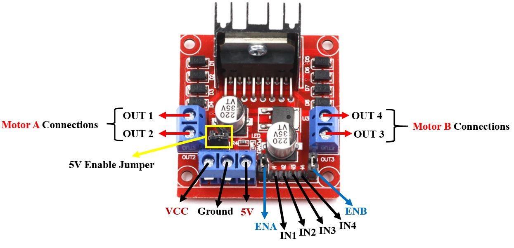

## A Simple Line Following Robot using Arduino uno.

## Connections
Refer to the below image while making connections. 

  

 

## Tools Used
* Arduino Uno, 2 * BO Motor (9-12V), L298N Motor Driver, 2 * Plastic Wheels, 2 * IR Sensor, Car's Chasis, Castor Wheel as Front wheel & 2 * Power Supply.

### Pin Connections corresponding to the [`Line Follower Robot's`](./lineFollowerRobot.ino) code 

<b>Out1 and Out2 pin side of the motor driver is the right side of the vehicle</b>

* Right motor: +ve end out2, -ve end out1
* Left motor: +ve end out3, -ve end out4
* Arduino 5V Power: 5V of driver
* Arduino Ground: Ground of Driver
* 9-12V External Power Supply: VCC of Driver
* D10 pin of Arduino: ENA of the Driver
* D4 pin of Arduino: IN1 of the Driver
* D5 pin of Arduino: IN2 of the Driver
* D2 pin of Arduino: IN3 of the Driver
* D3 pin of Arduino: IN4 of the Driver
* D9 pin of Arduino: ENB of the Driver
* D11 pin of Arduino: Right IR Sensor
* D12 pin of Arduino: Left IR Sensor

## Live Project Demonstration
* Youtube: https://youtu.be/NdbG9M8FO6E
